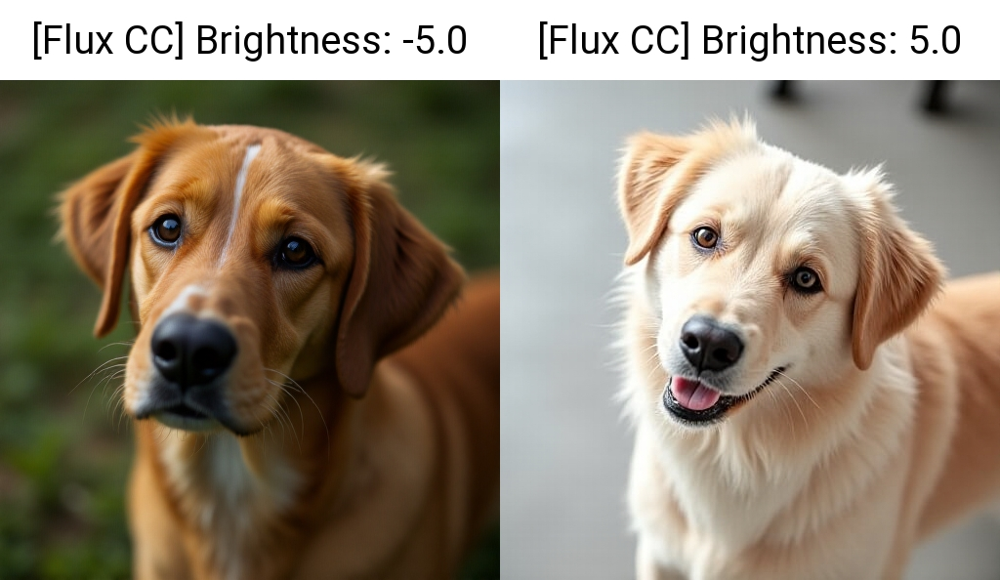
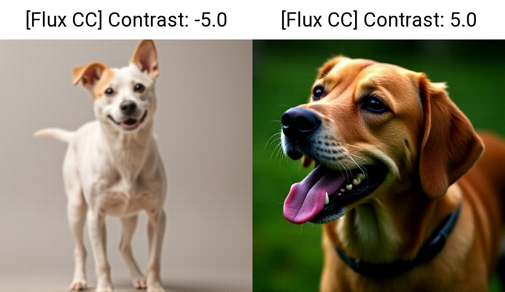
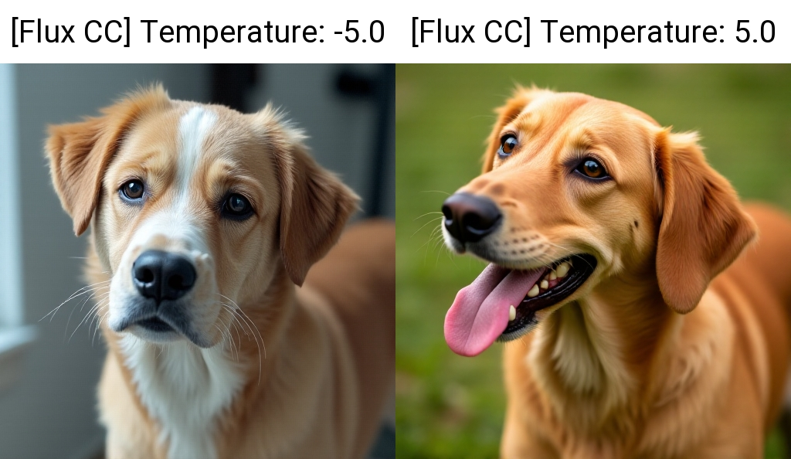
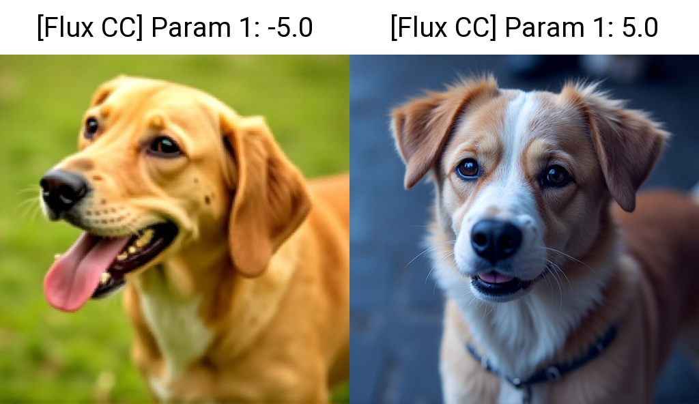
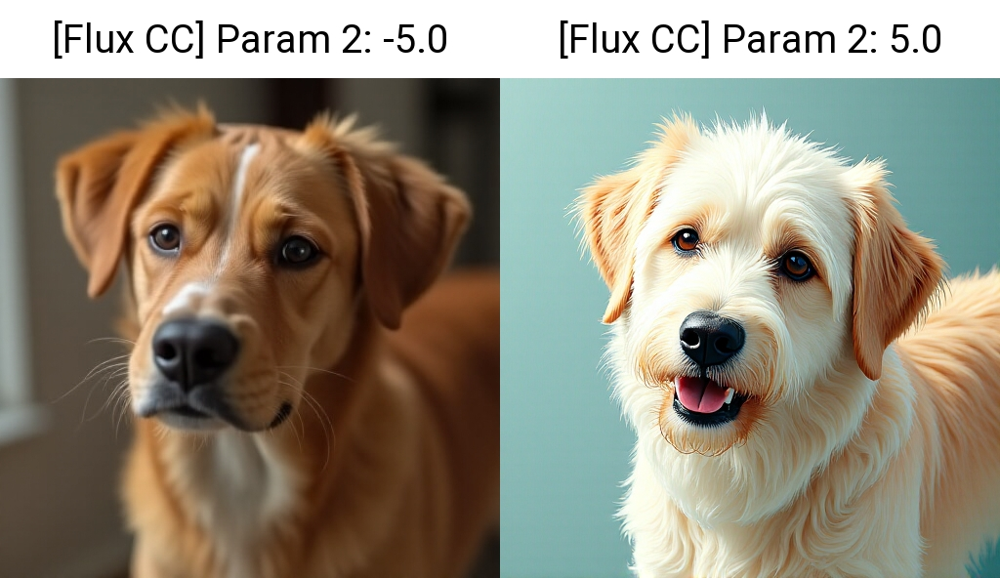
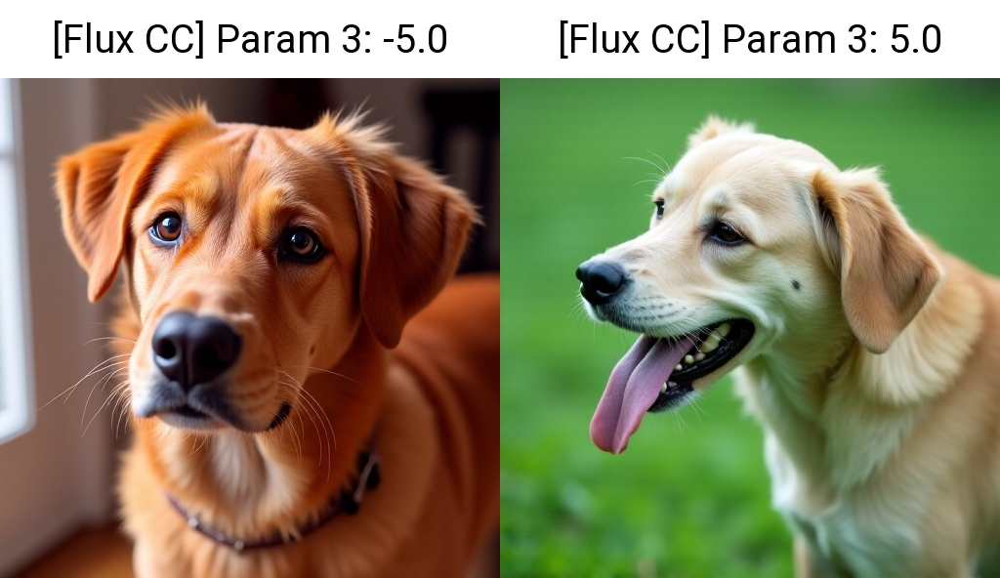
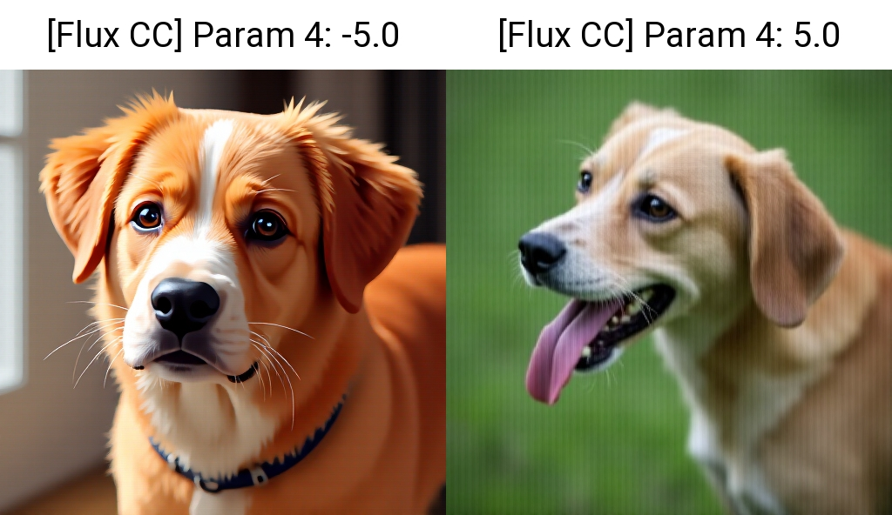
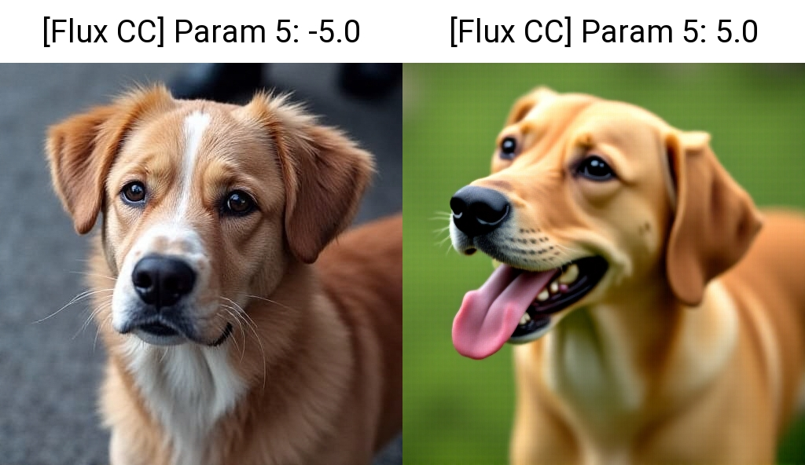
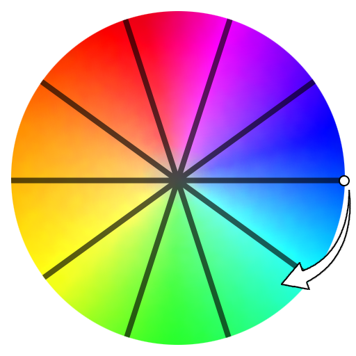

# SD Forge Flux CC

#### Public Beta

This is an Extension for the [Forge Webui](https://github.com/lllyasviel/stable-diffusion-webui-forge), built on top of [Vectorscope CC](https://github.com/Haoming02/sd-webui-vectorscope-cc) specifically for **Flux** checkpoints, which performs a kind of **Offset Noise** natively during inference, allowing you to adjust the brightness, contrast, and color of the generations.

> Should also work for [Automatic1111 Webui](https://github.com/AUTOMATIC1111/stable-diffusion-webui) once it supports **Flux** checkpoints

> *Probably also works for **SD3**?*

## Example Images

Infotext

- **Prompt:** `dog`
- **Steps:** `24`
- **Sampler:** `Euler`
- **Schedule type:** `Simple`
- **CFG scale:** `1`
- **Distilled CFG Scale:** `3.5`
- **Seed:** `8756`
- **Size:** `512x512`
- **Model:** `flux1-dev-bnb-nf4-v2`
- **Flux CC Scaling:** `Cos`

 
<code>Base Image</code>

 
<code>Brightness</code>

 
<code>Contrast</code>

 
<code>Temperature</code>

 
<code>Param 1</code>

 
<code>Param 2</code>

 
<code>Param 3</code>

 
<code>Param 4</code>

 
<code>Param 5</code>

- Value too high / low often causes artifacts
- Works better with higher steps *(`dev`)*, as the lower steps *(`schnell`)* usually makes the effects too strong

## What the Heck are these Parameters?

Unlike **SD1** and **SDXL**, where their `VAE` only consists of **4** channels, and can be easily mapped to different color models; the `VAE` of **Flux** has a whopping **16** channels. After some limited experiments, this is the best way I can group the parameters so far...

 
<code>param1</code> is the horizontal line, while the rest kinda map in the clock-wise direction...

> [!NOTE]
> <b>Help Wanted</b> 
> Need more testing with the color channels for better labeling... Either with this Extension, or with the [latent-playground](https://github.com/Haoming02/sd-webui-latent-playground)

- **Reference:**
    - https://github.com/Haoming02/sd-webui-latent-playground
    - https://github.com/Haoming02/sd-webui-vectorscope-cc
    - https://github.com/Haoming02/sd-webui-diffusion-cg
